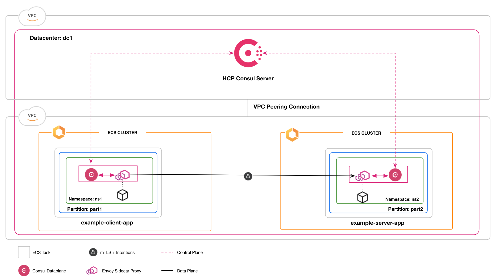

# Consul on ECS - Admin Partitions and Namespaces

This folder provides an example of using Admin Partitions and Namespaces with Consul on ECS.

The [Terraform code](./terraform/) in this example manages the following infrastructure:
- Consul Enterprise running on HashiCorp Cloud Platform.
- Two AWS ECS clusters.
- Tasks running on AWS Fargate.
- A client [`mesh-task`](../../modules/mesh-task/) running in an ECS cluster scoped to a Consul Admin Partition and Namespace.
- A server [`mesh-task`](../../modules/mesh-task/) running in a separate ECS cluster scoped to a different Consul Admin Partition and Namespace.



To enable cross-partition communication the following conditions must be met:
- Both ECS clusters must be in the same region and VPC. This is performed by the Terraform setup.
- Consul must have an [`exported-services` config entry](https://www.consul.io/docs/connect/config-entries/exported-services) to expose the Admin Partition of the server to the client. This step is performed by the `ap-example` script.
- Consul must have a [Service to service intention](https://www.consul.io/docs/connect/intentions) to allow the client to call the server.  This step is performed by the `ap-example` script.

## Requirements

* `curl`
* `jq`
* `terraform`
* `aws` CLI
* AWS Session Manager Plugin
* AWS credentials

## Usage

### Setup

Clone this repository:

```console
$ git clone https://github.com/hashicorp/terraform-aws-consul-ecs.git
$ git checkout tags/<latest-version>
$ cd terraform-aws-consul-ecs/examples/admin-partitions
```

This module contains everything needed to spin up and run the example.

### Terraform

To stand up the necessary infrastructure:

```console
$ cd terraform
$ terraform init
$ terraform apply -auto-approve
$ cd ..
```

**NOTE:** Terraform may output an error similar to the following related to the `service-intentions` resource:

```
╷
│ Error: failed to read config entry after setting it.
│ This may happen when some attributes have an unexpected value.
│ Read the documentation at https://www.consul.io/docs/agent/config-entries/service-intentions.html
│ to see what values are expected.
│
│   with consul_config_entry.service_intentions,
│   on hcp_consul.tf line 101, in resource "consul_config_entry" "service_intentions":
│  101: resource "consul_config_entry" "service_intentions" {
│
╵
```

This is a known issue and the service intention should still be created.
This can be confirmed by checking the service intention config entry has been added to Consul:

```console
$ export CONSUL_HTTP_ADDR=$(cd terraform ; terraform output -json | jq -rc '.hcp_public_endpoint.value')
$ export CONSUL_HTTP_TOKEN=$(cd terraform ; terraform output -json | jq -rc '.token.value')
$ consul config read -kind service-intentions -partition part2 -namespace ns2 \
  -name $(consul config list -kind service-intentions -partition part2 -namespace ns2)
```

### Call an Upstream in a different Admin Partition

Run the example test to confirm communication between client and server in different Admin Partitions and Namespaces:

```console
$ ./ap-example
```

This step can take several minutes, after which time you should see some JSON output similar to the following:

```json
{
  "name": "Service",
  "uri": "/",
  "type": "HTTP",
  "ip_addresses": [
    "169.254.172.2",
    "10.0.1.63"
  ],
  "start_time": "2022-03-22T18:23:51.792908",
  "end_time": "2022-03-22T18:23:51.793209",
  "duration": "300.682µs",
  "body": "Hello World",
  "code": 200
}
```

### Clean up

To tear down the infrastructure that was created:

```console
$ cd terraform
$ terraform destroy -auto-approve
$ cd ..
```

## Next Steps

Next, see our [full documentation](https://www.consul.io/docs/ecs) when you're ready to deploy your own applications
into the service mesh.
