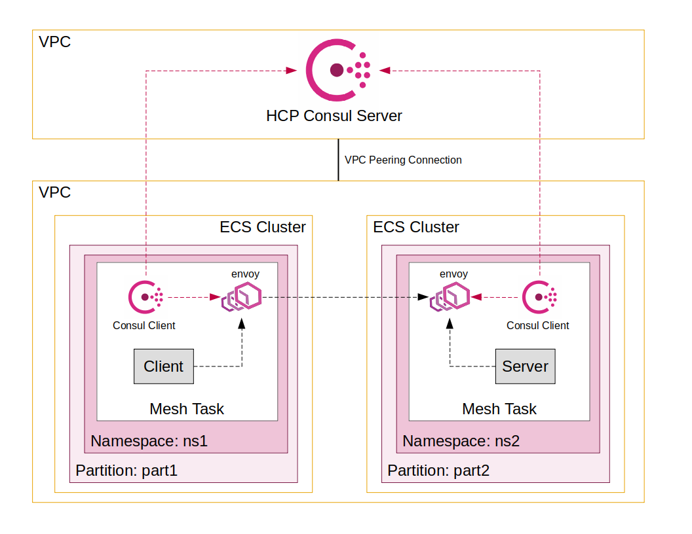

# Consul on ECS - Admin Partitions and Namespaces

This folder provides an example of using Admin Partitions and Namespaces with Consul on ECS.



The [Terraform code](./terraform/) in this example manages the following infrastructure:
- Consul Enterprise running on HashiCorp Cloud Platform.
- Two AWS ECS clusters.
- Tasks running on AWS Fargate.
- A client [`mesh-task`](../../modules/mesh-task/) running in an ECS cluster scoped to a Consul Admin Partition and Namespace.
- A server [`mesh-task`](../../modules/mesh-task/) running in a separate ECS cluster scoped to a different Consul Admin Partition and Namespace.

To enable cross-partition communication the following conditions must be met:
- Both ECS clusters must be in the same region and VPC. This is performed by the Terraform setup.
- Consul must have an [`exported-services` config entry](https://www.consul.io/docs/connect/config-entries/exported-services) to expose the Admin Partition of the server to the client. This step is performed by the `ap-example` script.
- Consul must have a [Service to service intention](https://www.consul.io/docs/connect/intentions) to allow the client to call the server.  This step is performed by the `ap-example` script.

## Prerequisites

The following tools are required to run the example:
- `curl`
- `jq`
- `terraform`
- `aws` CLI
- AWS Session Manager Plugin
- AWS credentials

## Usage

To stand up the necessary infrastructure:

```sh
cd terraform
terraform apply -auto-approve
cd ..
```

Run the example test to confirm communication between client and server in different Admin Partitions and Namespaces:

```sh
./ap-example
```

This step can take several minutes, after which time you should see some JSON output similar to the following:

```json
{
  "name": "Service",
  "uri": "/",
  "type": "HTTP",
  "ip_addresses": [
    "169.254.172.2",
    "10.0.1.63"
  ],
  "start_time": "2022-03-22T18:23:51.792908",
  "end_time": "2022-03-22T18:23:51.793209",
  "duration": "300.682µs",
  "body": "Hello World",
  "code": 200
}
```

To tear down the infrastructure that was created:

```sh
cd terraform
terraform destroy -auto-approve
cd ..
```
