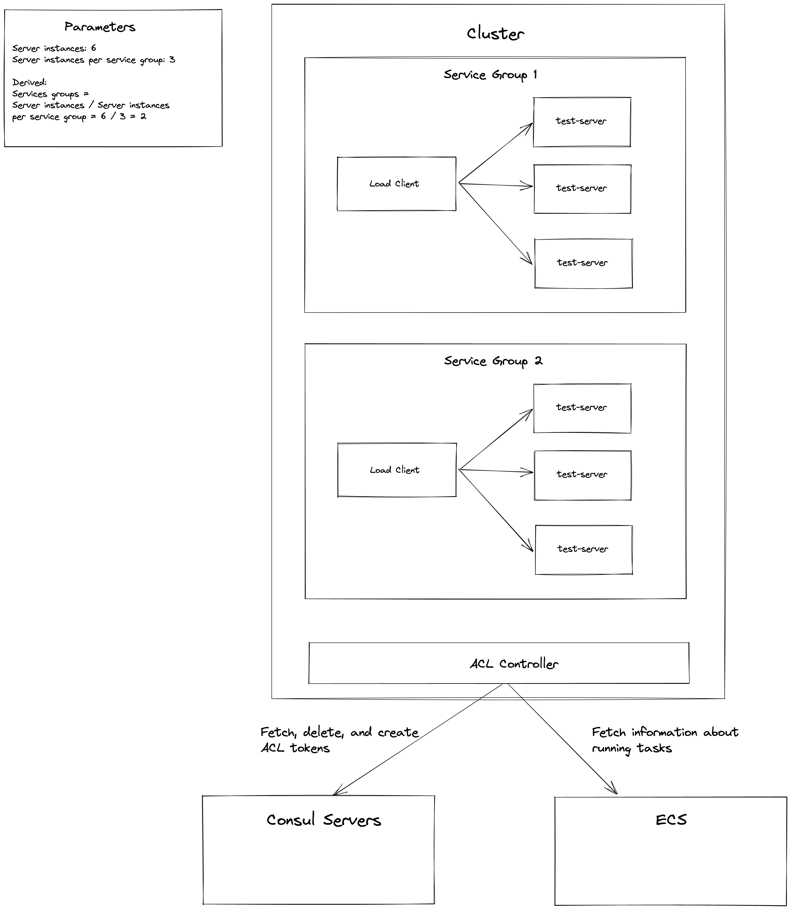
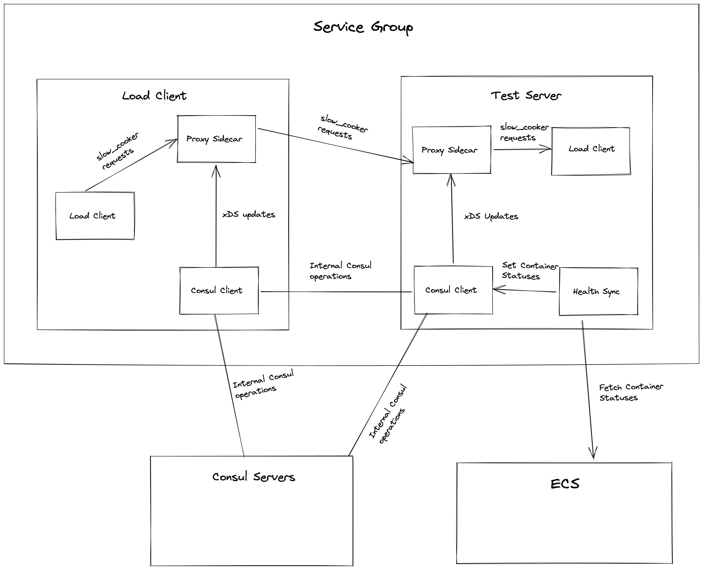

# Performance Tests

## Goals

1. Stress test the gossip layer on ECS
2. Determine how much extra CPU, memory and network usage users need for their tasks to run.

## Instructions

1. Ensure the proper AWS credentials are set in environment variables.
2. Run the tests using commands like:
   `go test ./... -v -datadog-api-key <DATADOG_API_KEY> -server-instances 20 -percent-restart 25 -restarts 2 -server-instances-per-service-group 10 -no-cleanup`

## Choosing Parameters

### Architecture Diagrams

It's difficult to choose parameters without understanding the architecture as a
whole so here are [a couple of C4 diagrams](https://c4model.com/) that visually
show how consul-ecs and this performance test work.

**Container Diagram**

Note that service groups are a made up abstraction that is useful for
understanding this performance test. It isn't an ECS, Consul, or consul-ecs
abstraction.

**Component Diagram**

### Choosing Parameters

The component diagram above describes the relationship between the containers
running within ECS tasks. We can use these relationships to determine the
factors that stress containers the most.

**Sidecar Proxy**

Factors:
* xDS updates - service churn
* Inbound and outbound request

How to test:
* Set `-server-instances`, `-percent-restart`, and `-restarts` to a large
  number to increase the amount of xDS updates Envoy receives.
* Decrease `-server-instances-per-service-group` so the test-server receives as
  much load as possible.

**Consul**

Factors:
* Number of services
* Frequency and duration of service churn

How to test:
* Set `-server-instances`, `-percent-restart`, `-restarts` and
  `-server-instances-per-service-group` to a large number to increase the
  gossip load on Consul clients.

**ACL Controller**

Factors:
* Number of services managed by consul-ecs in the cluster.
* ECS services toggling between running to stopped
* Number of tasks running

How to test:
* Setting `-server-instances-per-service-group` to 1 and `-server-instances` to
  a relatively small number is fine.
* Set `-percent-restart` to 100 so tokens will be continuously
  created and deleted.
* Set `-restarts` to a large number to see how the ACL controller responds to
  constant task churning.

## Rough Edges

* When Terraform deletes the intentions, it frequently breaks and I have to
  hack the terraform.tfstate file so it can complete
* There are no Envoy metrics
* Little effort has gone into making the code mergeable
